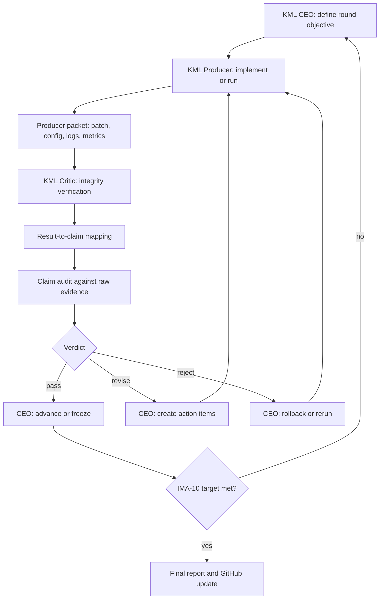

# KML-ARIS Workflow



## Round Contract

Every round must produce the following files or links:

```text
round_id:
objective:
commit:
config:
command:
gpu:
raw_log:
parsed_metrics:
critic_verdict:
ceo_decision:
```

## Evidence Command

```bash
python tools/parse_cil_results.py logs/ImageNet_A/10_tasks --out evidence/ima10_results.csv
```

## Stop Rule

The loop stops only when all conditions hold:

- Three seeds finished.
- `ALast > 64.14`.
- `AAvg > 71.45`.
- Critic verdict is `pass`.
- Claim ledger links every accepted claim to raw logs.

